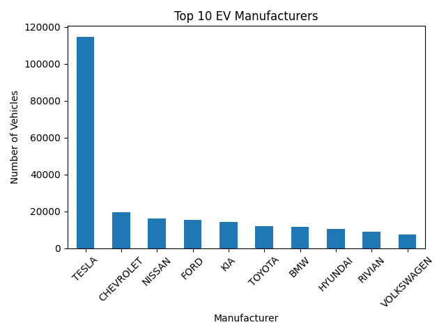
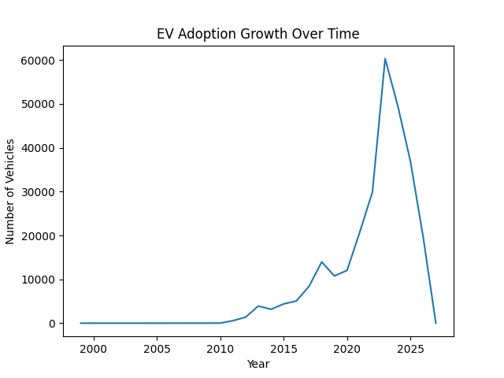

# EV Market Adoption Analysis

Analyzed electric vehicle registration data to identify adoption trends, leading manufacturers, geographic distribution, and market growth using Python, Pandas, and data visualization.

## Overview
This project analyzes electric vehicle (EV) population data to understand adoption trends, leading manufacturers, and geographic distribution within Washington State.

## Objective
Identify patterns in EV growth, market dominance, and regional adoption using exploratory data analysis and visualization.

## Tools Used
- Python
- Pandas
- Matplotlib

## Key Analysis
- Data cleaning and preprocessing
- EV adoption trends over time
- Top manufacturers analysis
- Geographic distribution (counties and cities)
- EV type distribution (BEV vs PHEV)

## Project Structure

```text
ev-market-adoption-analysis/
│
├── data/
│   └── Electric_Vehicle_Population_Data.csv
│
├── notebooks/
│   └── ev_analysis.ipynb
│
├── visuals/
│   └── charts/
│       ├── top_manufacturers.png
│       ├── ev_growth.png
│       ├── top_counties.png
│       ├── ev_type.png
│       └── top_cities.png
│
├── requirements.txt
└── README.md
```

## Key Insights

- EV adoption has grown significantly after 2020  
- Tesla dominates the EV market  
- EV adoption is concentrated in specific counties and cities within Washington State  
- Battery Electric Vehicles (BEVs) are more common than Plug-in Hybrid Electric Vehicles (PHEVs)  
- Urban areas show higher EV adoption

## Sample Visualizations




## Usage

Open the notebook and run all cells to reproduce analysis and visualizations.

## Installation instructions

1. Install dependencies:
   pip install -r requirements.txt

2. Open notebook:
   notebooks/ev_analysis.ipynb

3. Run all cells
